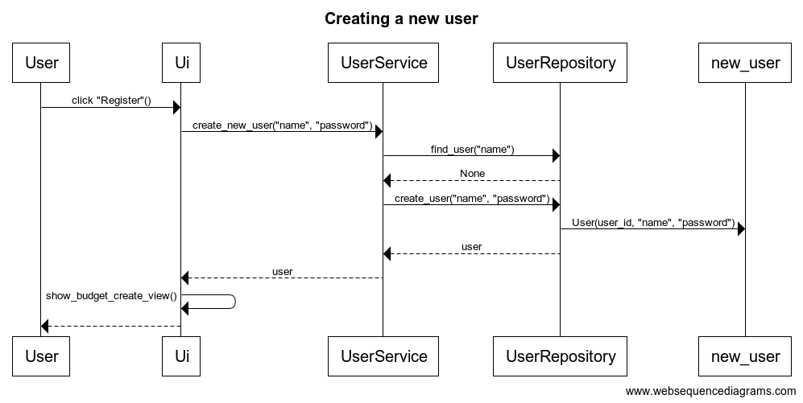

# Arkkitehtuurikuvaus

## Rakenne

Kuvassa on esitelty koodin pakkausrakenne ja luokat

Services-luokan UserServices mahdollisesti pilkotaan User-, Budget- ja Expense-service luokkiin.

## Toiminnallisuudet

Kuvassa on esitetty käyttäjän rekisteröinnin sekvenssikaavio

