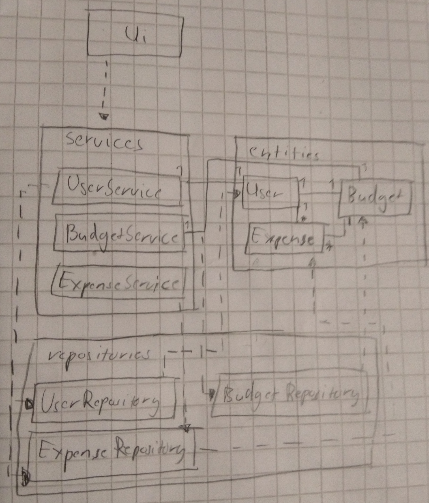

# Arkkitehtuurikuvaus

## Rakenne

Kuvassa on esitelty koodin pakkausrakenne ja luokat. Ohjelman rakenne noudattelee kolmitasoista kerrosarkkitehtuuria.

Pakkaus Ui sisältää käyttöliittymästä vastavaa koodin, services sovelluslogiikan ja repositories tietokantatoiminnoista vastavan koodin. Pakkaus entities sisältää taas luokkia jotka kuvaavat ohjelman tietokohteita.

## Käyttöliittymä

Käyttöliittymässä on viisi erillistä näkymää ja kuusi luokkaa:

* Kirjautuminen ja rekisteröinti
* Budjetin summan valinta
* Budjetin kategorioiden summien valinta
* Budjetin tarkastelu
* Kulun lisäys
* Budjetin graafinen tarkastelu (vain luokka)

Nämä on toteutettu omina luokkinaan ja näistä jokainen on yksi kerrallaan näkyvillä budjetin graafista tarkastelua lukuunottamatta. Budjetin graafinen tarkastelu on tehty omana luokkanaan jota 'Budjetin tarkastelu'-näkymä kutsuu ja nämä näkyvät samanaikaisesti käyttäjälle. Näkyminen näyttämisestä vastaa UI-luokka. Käyttöliittymä on pyritty eristämään sovelluslogiikasta ja se vain kutsuu UserService-luokan metodeja.

## Sovelluslogiikka

Sovelluksen loogisen tietomallin muodostavat luokat User, Budget ja Expense, jotka kuvaavat käyttäjiä ja heidän tekemiä budjetteja ja niihin liittyviä sovellukseen syötettyjä kuluja.

Sovelluksen toimintalogiikasta vastaavat paukkauksen services UserService, BudgetService ja ExpenseService -luokkien oliot. Nämä tarjoavat kaikille käyttöliittymän toiminnoille omat metodinsa jotka liittyvät kunkin tietomallin toimintoihin. Näitä ovat UserServicessä User-luokkaan liittyvät, esimerkiksi:
* create_new_user(username, password)
* login(username, password)
* find_expenses()

BudgetServicessä Budget-luokkaan liittyvät, esimerkiksi:
* create_budget(amount)
* show_budget()
* modify_budget()

ja ExpenseServicessä Expense-luokkaan liittyvä:
* create_expense(amount, category, comment, datenow)

UserService pääsee myös käsiksi tietokantoihin liittyviin ExpenseRepository ja UserRepository -luokkiin, jotka annetaan UserService-luokalle konstruktorikutsun yhteydessä. Näin sovelluslogiikka voi hoitaa käyttäjiin ja näihin liittyviin kuluihin (jotka tallennetaan käyttäjäolioon) liittyvien tietojen tallennuksen.

BudgetService pääsee ainoastaan käsiksi BudgetRepository-luokkaan joka hoitaa budjetteihin liittyvän tietojen tallennuksen. ExpenseService pääsee samoin käsiksi vain ExpenseRepository-luokkaan, joka hoitaa kuluihin liittyvän tietojen tallennuksen. Nämä molemmat luokat myös kutsuvat UserService-luokkaa saadakseen tiedon käyttäjän tunnistenumerosta jota ne käyttävät tietojen tallentamiseen tietokantaan oikealle käyttäjälle.

## Tietojen pysyväistallennus

Pakkauksen repositories luokat BudgetRepository, ExpenseRepository ja UserRepository hoitavat kuhunkin luokkaan liittyvien tietojen tallentamisen SQLite-tietokantaan. Tietokanta alustetaan alustetaan initialize_database.py-tiedostossa. Käyttäjiin liittyvät tiedot tallennetaan Users-tauluun, budjetteihin liittyvä tieto Budget-tauluun ja kuluihin liittyvä tieto Expense-tauluun. Taulut on sidottu toisiinsa User-taulun user_id-numeron perusteella.

## Toiminnallisuudet

Kuvataan muutama sovelluksen toiminnallisuus sekvenssikaavioiden avulla:

### Käyttäjän rekisteröinti

Kun käyttäjä on syöttänyt aloitusruudussa 'Make a new user'-kohtaan käyttäjätunnuksen, joka ei ole jo käytössä, ja salasanan, jotka ovat molemmat vähintään neljä merkkiä pitkiä ja painaa 'Register'-näppäintä, sovelluksen toiminta etenee seuraavasti:

Tapahtumakäsittelijä kutsuu UserService-luokan metodia create_new_user annetuilla käyttäjänimen ja salasanan parametreillä. UserService selvittää UserRepositoryn kautta tietokannasta onko käyttäjänimi jo olemassa. Jos ei niin UserService voi kutsua UserRepositoryn create_user-metodia ja luoda tietokantaan uuden käyttäjän. Tämä luo samalla uuden käyttäjäolion, joka palautetaan takaisin ja käyttäjä siirretään luomaan uutta budjettia show_budget_create_view-näkymään.

### Uuden kulun lisäys

Kun käyttäjä on uuden kulun lisäksen ruudussa ja on täyttänyt valikkoon numeraalisen summan, valinnut sopivan kategorian ja päivämäärän, sekä mahdollisesti syöttänyt enintään 50 merkkiä pitkän kommentin ja painaa 'Add'-painiketta, sovelluksen toiminta etenee seuraavasti:

Tapahtumakäsittelijä kutsuu ExpenseService-luokan metodia create_expense syötetyillä parametreilla. ExpenseService kysyy UserService-luokalta käyttäjän id-numeron show_id-metodilla ja saa sen takaisin. Tämän jälkeen ExpenseService luo uuden Expense-olion, jonka se antaa UserService-luokalle add_expense-metodilla joka lisää sen nykyiselle käyttäjäoliolle. Tämän jälkeen ExpenseService kutsuu ExpenseRepositoryn create_expense-metodia joka lisää kulun tiedot tietokantaan. Tämän jälkeen käyttöliittymä siirtää käyttän tarkastelemaan budjetin tietoja show_budget_view-näkymään.

### Muut toiminnallisuudet

Muut toiminnallisuudet seuraavat pitkälti samaa periaattetta. Käyttöliittymän tapahtumakäsittelijä kutsuu sovelluslogiikan metodia, joka mahdollisesti tallentaa tai hakee tietokanta-luokalta tietoa tai vain kertoo jo käyttäjä- tai budjettiolioissa olevan tiedon takaisin käyttöliittymään joka päivittyy näiden tietojen perusteella tai siirtyy seuraavaan näkymään.