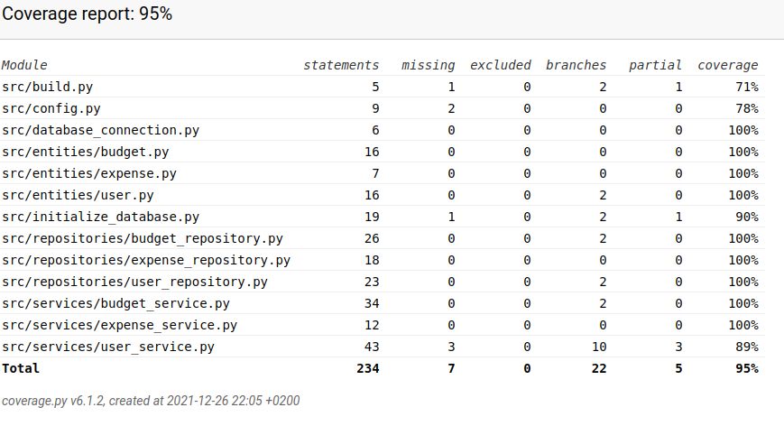

# Testausdokumentti

Ohjelmaa on testattu sekä automatisoiduilla yksikkö- ja integraatiotestein unittestin avulla, että manuaalisesti järjestelmätasolla.

## Yksikkö- ja integraatiotestaus

### Sovelluslogiikka

Sovelluslogiikasta vastaavia UserService, BudgetService ja ExpenseService -luokkia testataan vastaavilla [TestUserService](https://github.com/hhautajarvi/ot2021/blob/master/src/tests/services/user_service_test.py), [TestBudgetService](https://github.com/hhautajarvi/ot2021/blob/master/src/tests/services/budget_service_test.py) ja [TestExpenseService](https://github.com/hhautajarvi/ot2021/blob/master/src/tests/services/expense_service_test.py) -luokkia. Näissä testitietokanta tyhjennetään ja tilalle luodaan sopivia testitapauksia.

### Repositorio-luokat

Tietojen tallenuksesta vastaavat BudgetRepository, ExpenseRepository ja UserRepository -luokat testataan testitietokantaa käyttäen joka määritellään .env.test-tiedostossa. Testaaminen suoritetaan [TestBudgetRepository](https://github.com/hhautajarvi/ot2021/blob/master/src/tests/repositories/budget_repository_test.py), [TestExpenseRepository](https://github.com/hhautajarvi/ot2021/blob/master/src/tests/repositories/expense_repository_test.py) ja [TestUserRepository](https://github.com/hhautajarvi/ot2021/blob/master/src/tests/repositories/user_repository_test.py) -luokilla.

### Tietomallit

Käyttäjä-, budjetti- ja kuluolioista vastaavat luokat User, Budget ja Expense testataan [TestUser](https://github.com/hhautajarvi/ot2021/blob/master/src/tests/entities/user_test.py), [TestBudget](https://github.com/hhautajarvi/ot2021/blob/master/src/tests/entities/budget_test.py) ja [TestExpense](https://github.com/hhautajarvi/ot2021/blob/master/src/tests/entities/expense_test.py) -luokkia käyttäen.

### Testauskattavuus

Testauksen haarumakattavuus on 95%, lukuunottamatta sen ulkopuolelle jätettyä käyttöliittymäkoodia.

Testaamatta jäi lähinnä sovelluksen alustamiseen ja lopettamiseen liittyviä metodeja ja tiedostoja. Myös rajatapauksia ja vääriä syötteitä yms. olisi voinut testata laajemmin, vaikka ne eivät testikattavuudessa näykään.

## Järjestelmätestaus

Järjestelmätestaus on suoritettu manuualisesti testaamalla erilaisia tilanteita.

### Asennus ja konfigurointi

Sovellus on haettu ja sitä on testattu [käyttöohjeen](https://github.com/hhautajarvi/ot2021/blob/master/dokumentaatio/kayttoohje.md) mukaisesti Linux-ympäristössä. Sovellusta on testattu sekä kun tietokantatiedostot ovat vielä olleet luomatta, sekä kun ne on jo luotu valmiiksi.

### Toiminnallisuudet

[Määrittelydokumentin](https://github.com/hhautajarvi/ot2021/blob/master/dokumentaatio/vaatimusmaarittely.md) ja käyttöohjeen listaamat toiminnallisuudet on kaikki testattu ja käyty läpi. Syötekenttiin on kokeiltu täyttää virheellisen tyyppisiä arvoja ja ne on myös kokeiltu jättää tyhjäksi.

## Sovellukseen jääneet laatuongelmat

Sovellus ei näytä mitään virheilmoituksia ainakaan tapauksissa joissa konfiguraation määrittelemiin tiedostoihin ei ole luku tai kirjoitusoikeuksia tai tietokannan alustuskomentoa ei ole suoritettu ennen ohjelman käynnistämistä. Myös tietokannan syötteet pitäisi tarkistaa paremmin ja varmistaa ettei sinne voi syöttää sopimatonta tai epämielekästä syötettä.